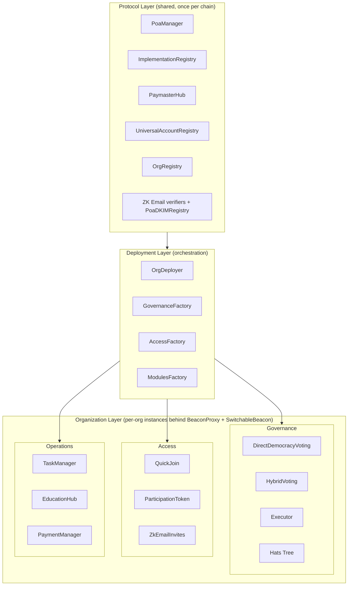
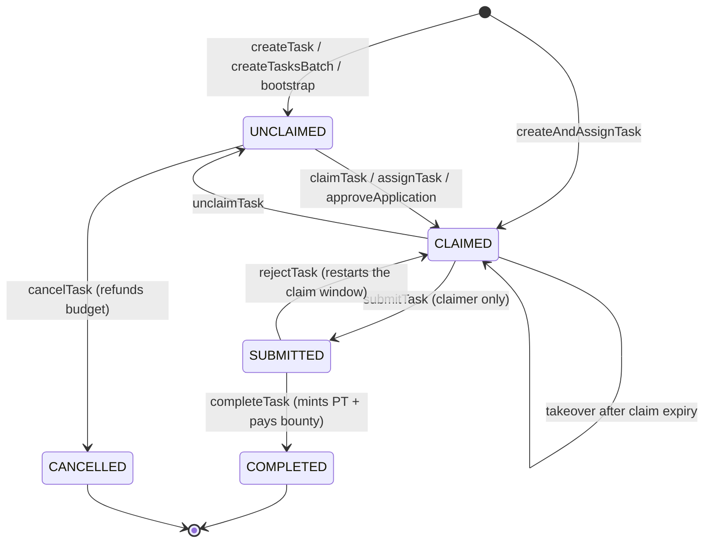
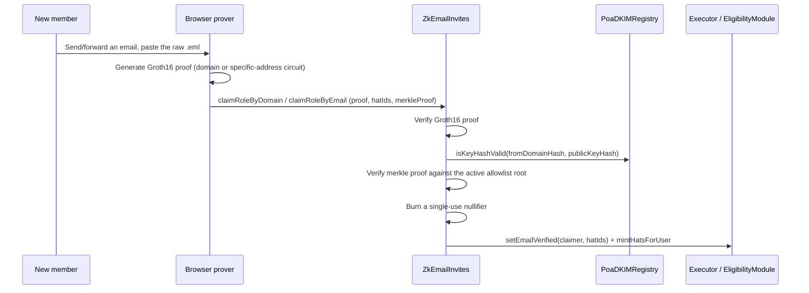
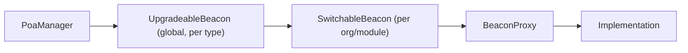
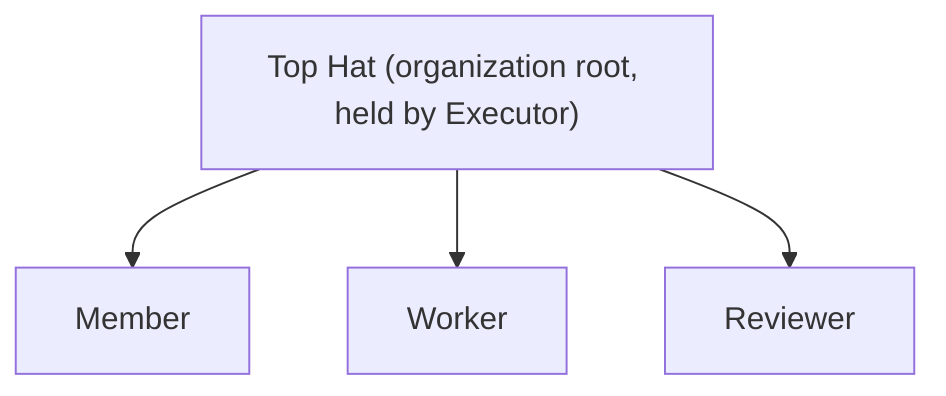

# Perpetual Organization Protocol (POP)

> Smart contracts for worker-owned, on-chain organizations.

[](LICENSE)
[](https://github.com/poa-box/POP/actions/workflows/ci.yml)
[](https://soliditylang.org)
[](https://getfoundry.sh)
[](slither.config.json)

POP is the contract layer for **Poa**, a no-code DAO builder for community- and worker-owned organizations. Members earn governance through contribution, not capital: every approved task mints non-transferable participation tokens to the worker who did the work. Decisions happen on-chain across multiple weighted voting classes, role assignments use [Hats Protocol](https://hatsprotocol.xyz), members join by peer vouch or by a zero-knowledge proof of email, and gas is sponsored via a multi-tenant ERC-4337 paymaster with a built-in solidarity fund.

This repository is the Solidity protocol: ~21K LOC across `src/`, 50+ test suites, mainnet on Arbitrum One and Gnosis (plus the cash-out relay on Base). If you're new here, start with [`docs/POP_OVERVIEW.md`](docs/POP_OVERVIEW.md) for the protocol philosophy, then come back here for the technical map.

---

## Table of Contents

1. [The POP Stack](#the-pop-stack)
2. [Live Deployments](#live-deployments)
3. [Why POP Exists](#why-pop-exists)
4. [Architecture](#architecture)
5. [Module Reference](#module-reference)
6. [Task Management](#task-management)
7. [Role Invitations via ZK Email](#role-invitations-via-zk-email)
8. [Upgradeability (SwitchableBeacon)](#upgradeability-switchablebeacon)
9. [Storage Model (ERC-7201)](#storage-model-erc-7201)
10. [Access Control (Hats Protocol)](#access-control-hats-protocol)
11. [Account Abstraction (ERC-4337)](#account-abstraction-erc-4337)
12. [Cash-Out (ZKP2P Off-Ramp)](#cash-out-zkp2p-off-ramp)
13. [Cross-Chain (Hyperlane)](#cross-chain-hyperlane)
14. [The Subgraph](#the-subgraph)
15. [The Frontend](#the-frontend)
16. [The CLI](#the-cli)
17. [Quick Start](#quick-start)
18. [Building & Testing](#building--testing)
19. [Deploying](#deploying)
20. [Security Model](#security-model)
21. [Contributing](#contributing)
22. [Documentation Index](#documentation-index)
23. [Community](#community)
24. [License](#license)

---

## The POP Stack

POP is split across four repositories. Changes to event signatures or storage layouts in this repo ripple into the subgraph and the frontend; coordinate accordingly (see [Contributing](#contributing)).

| Repo | Role | Tech |
|------|------|------|
| **[poa-box/POP](https://github.com/poa-box/POP)** *(this repo)* | Solidity protocol contracts | Foundry · Solidity `^0.8.17`–`^0.8.30` |
| **[poa-box/subgraph-pop](https://github.com/poa-box/subgraph-pop)** | The Graph indexer turning POP events into a GraphQL API | TypeScript · AssemblyScript · Graph CLI |
| **[poa-box/Poa-frontend](https://github.com/poa-box/Poa-frontend)** | Next.js web app at [poa.box](https://poa.box) | Next.js 14 · wagmi · RainbowKit · viem · Apollo · Pimlico |
| **[poa-box/poa-cli](https://github.com/poa-box/poa-cli)** | CLI and autonomous-agent framework | TypeScript |

All four repos are AGPL-3.0.

---

## Live Deployments

**Mainnet:** Arbitrum One (chain `42161`), Gnosis (chain `100`). `CashOutRelay` is a standalone singleton on Base (chain `8453`) — see [Cash-Out](#cash-out-zkp2p-off-ramp).
**Testnets:** Sepolia (`11155111`), Base Sepolia (`84532`), Optimism Sepolia (`11155420`), Arbitrum Sepolia (`421614`), Hoodi (`560048`).

The canonical, current set of protocol-layer addresses for each chain lives in [`script/config/infrastructure.json`](script/config/infrastructure.json) and is automatically loaded by `DeployOrg.s.sol`. There is no need to copy addresses by hand. A snapshot of the testnet infrastructure addresses:

| Contract | Address |
|----------|---------|
| OrgDeployer | `0x888daCE32d8BCdDD95BA9D490643663C25810ded` |
| PoaManager | `0x868680dc2689fa49A8389b0313da15408C8BE340` |
| OrgRegistry | `0xBBf72057901d7d0F557D6f7Aa1Afc56F4F3d6072` |
| ImplementationRegistry | `0xe848C652e1Aa56BeC38f504259f5D2b98b585aed` |
| PaymasterHub | `0xbe2c8713F762871b14dc2273B389a210974dB755` |
| UniversalAccountRegistry | `0xDdB1DA30020861d92c27aE981ac0f4Fe8BA536F2` |
| GovernanceFactory | `0x2e3BCa0b6902285b7e8D747A14f118EbB8DB997D` |
| AccessFactory | `0x05Db5Cf1540683A888E7aC656d7373aa03864a8c` |
| ModulesFactory | `0x0b5b1410E6e8FeE4eCd07C69CdDCf860eCc44981` |
| HatsTreeSetup | `0xdc7C14AB68fcCf9bcD255f5be684EbDc892Da13a` |
| Hats Protocol (external) | `0x3bc1A0Ad72417f2d411118085256fC53CBdDd137` |

Always treat `script/config/infrastructure.json` as the source of truth. This table can drift between releases.

**Per-module implementation versions** (which `ImplementationRegistry` version string each beacon currently points at, on both mainnets) are tracked in [`docs/audit/AUDIT_STATUS.md`](docs/audit/AUDIT_STATUS.md). Read that file before assuming a deployment is stale — and always diff against a `FOUNDRY_PROFILE=production` build, since the default profile has the optimizer off and produces roughly twice the bytecode.

---

## Why POP Exists

- **Work creates ownership.** Participation tokens are minted on approved task completion and are non-transferable. You earn ownership through contribution; you cannot buy in.
- **One member, one voice (when it matters).** `DirectDemocracyVoting` enforces 100 voting points per eligible member. Wealth cannot tilt the outcome.
- **Multiple stakeholders, proportional voice.** `HybridVoting` composes weighted classes (e.g., 50% direct democracy, 50% token-weighted with optional quadratic) so organizations can balance constituencies.
- **Collective infrastructure, individual autonomy.** Orgs share an upgrade beacon, an account registry, and a paymaster with a solidarity fund, while each org governs itself and can pin to a specific implementation at any time.
- **Joining should not require crypto.** A member joins by peer vouch or by a zero-knowledge proof of email — register a passkey, get vouched for or prove an allowlisted email, receive your role hats, and start working, without ever holding ETH or a seed phrase.
- **Transparency by default.** Proposals, votes, tasks, payments and role assignments are all on-chain. The subgraph turns those events into a queryable history.

Read [`docs/POP_OVERVIEW.md`](docs/POP_OVERVIEW.md) for the long version.

---

## Architecture

POP organizations are deployed atomically by composing three layers of contracts. The protocol layer is shared across all orgs on a chain; the deployment layer creates new orgs in a single transaction; each organization owns its own per-org instances of the modules.



**Protocol Layer** (deployed once per chain, persistent, upgradeable, shared):

| Contract | Path | Purpose |
|----------|------|---------|
| `PoaManager` | [`src/PoaManager.sol`](src/PoaManager.sol) | Owns the global `UpgradeableBeacon` instances per contract type. Single upgrade authority. Non-upgradeable itself. |
| `ImplementationRegistry` | [`src/ImplementationRegistry.sol`](src/ImplementationRegistry.sol) | Records every implementation version registered with the protocol, keyed `(typeName, version)`. |
| `OrgRegistry` | [`src/OrgRegistry.sol`](src/OrgRegistry.sol) | Enumerates every deployed organization and its module addresses. |
| `UniversalAccountRegistry` | [`src/UniversalAccountRegistry.sol`](src/UniversalAccountRegistry.sol) | Cross-org username + account mapping (one identity, many orgs). |
| `PaymasterHub` | [`src/PaymasterHub.sol`](src/PaymasterHub.sol) | Multi-tenant ERC-4337 paymaster with a solidarity fund. |
| `PoaDKIMRegistry` | [`src/zkemail/PoaDKIMRegistry.sol`](src/zkemail/PoaDKIMRegistry.sol) | ERC-7969 DKIM public-key-hash allowlist consumed by every org's `ZkEmailInvites`. Non-upgradeable by design. |
| Groth16 verifiers | [`src/zkemail/vendor/`](src/zkemail/vendor) | Circuit-specific ZK Email proof verifiers (domain claims and specific-address claims). |

**Deployment Layer** (also deployed once per chain; orchestration only):

| Contract | Path | Purpose |
|----------|------|---------|
| `OrgDeployer` | [`src/OrgDeployer.sol`](src/OrgDeployer.sol) | Atomic full-org deployment in one transaction (~22.5M gas). Also seeds the org's paymaster rules and budgets and bootstraps deploy-time TaskManager permissions. |
| `GovernanceFactory` | [`src/factories/GovernanceFactory.sol`](src/factories/GovernanceFactory.sol) | Deploys `Executor`, `HybridVoting`, `DirectDemocracyVoting`, and coordinates the org's Hats tree via `HatsTreeSetup`. |
| `AccessFactory` | [`src/factories/AccessFactory.sol`](src/factories/AccessFactory.sol) | Deploys `QuickJoin` and `ParticipationToken`. |
| `ModulesFactory` | [`src/factories/ModulesFactory.sol`](src/factories/ModulesFactory.sol) | Deploys `TaskManager`, `PaymentManager`, and optionally `EducationHub` and `ZkEmailInvites`. |
| `HatsTreeSetup` | [`src/HatsTreeSetup.sol`](src/HatsTreeSetup.sol) | Helper called by `GovernanceFactory` to mint the top hat and role hats, then hand `EligibilityModule`/`ToggleModule` admin rights to the org's `Executor`. |

**Organization Layer** (per-org instances behind `BeaconProxy` + `SwitchableBeacon`):

| Contract | Path | Purpose |
|----------|------|---------|
| `Executor` | [`src/Executor.sol`](src/Executor.sol) | Sole call-execution layer; only the authorized voting contract may invoke `execute()`. Ownership renounced after setup. |
| `HybridVoting` | [`src/HybridVoting.sol`](src/HybridVoting.sol) | Multi-class weighted voting with optional quadratic per class, plus an optional voter-count quorum. |
| `DirectDemocracyVoting` | [`src/DirectDemocracyVoting.sol`](src/DirectDemocracyVoting.sol) | One-member-one-voice (100 points each), multi-option proposals, optional voter-count quorum. |
| `ParticipationToken` | [`src/ParticipationToken.sol`](src/ParticipationToken.sol) | Non-transferable ERC20Votes minted by `TaskManager`/`EducationHub`. |
| `TaskManager` | [`src/TaskManager.sol`](src/TaskManager.sol) | Project/task/application lifecycle with stablecoin bounties, folders, deadlines and an 8-flag permission bitmask. See [Task Management](#task-management). |
| `EducationHub` | [`src/EducationHub.sol`](src/EducationHub.sol) | On-chain learning modules that mint participation tokens on completion. |
| `QuickJoin` | [`src/QuickJoin.sol`](src/QuickJoin.sol) | Username registration + member-hat minting in a single call; also the self-service `claimHats` path. |
| `ZkEmailInvites` | [`src/ZkEmailInvites.sol`](src/ZkEmailInvites.sol) | Claim role hats by proving control of an allowlisted email address or domain in zero knowledge. See [Role Invitations](#role-invitations-via-zk-email). |
| `PaymentManager` | [`src/PaymentManager.sol`](src/PaymentManager.sol) | Merkle-distribution treasury claims proportional to participation. |
| `EligibilityModule` | [`src/EligibilityModule.sol`](src/EligibilityModule.sol) | Hats eligibility module: hierarchy rules, peer vouching, and email-verified eligibility. All writes are `superAdmin`-only (the org `Executor`). |
| `ToggleModule` | [`src/ToggleModule.sol`](src/ToggleModule.sol) | Hats toggle module; lets governance enable or disable a hat without revoking it. |

---

## Module Reference

Beyond the headline contracts, the source tree contains:

- **[`src/libs/`](src/libs)** holds shared libraries.
  - `HybridVotingCore.sol` / `HybridVotingConfig.sol` / `HybridVotingProposals.sol`: these three libraries **share a single ERC-7201 namespace** (`keccak256("poa.hybridvoting.v2.storage")`). When you change one, you must keep all three in sync.
  - `HatManager.sol`: batch operations over Hats (`hasAnyHat`, `setHatInArray`).
  - `RoleResolver.sol`: resolves an org-config role index to a minted hat ID; reverts `UnregisteredRole` rather than silently resolving to hat 0.
  - `TaskPerm.sol`: the 8-flag `uint8` task-permission bitmask (see [Task Management](#task-management)).
  - `ValidationLib.sol`: `requireNonZeroAddress`, `requireValidCap`, `MAX_PAYOUT` and friends; use these at boundaries.
  - `VotingMath.sol` / `BudgetLib.sol`: quadratic/weighted vote math and project budget accounting, factored out of the voting contracts and `TaskManager`.
  - `ModuleTypes.sol`: the canonical `keccak256(moduleName)` type IDs used by `PoaManager` and `OrgRegistry`.
  - `BeaconDeploymentLib.sol` / `ModuleDeploymentLib.sol`: shared beacon-and-proxy creation used by the three factories.
  - `PaymasterHubErrors.sol`, `PaymasterGraceLib.sol`, `PaymasterPostOpLib.sol`, `PaymasterCalldataLib.sol`, `PaymasterAdminLib.sol`, `PaymasterFinanceLib.sol`, `PaymasterSponsorshipLib.sol`: `PaymasterHub` is size-constrained by EIP-170, so most of its logic lives in these libraries (~1,370 LOC across the seven, versus ~1,633 in the hub itself). `PaymasterAdminLib`, `PaymasterFinanceLib` and `PaymasterSponsorshipLib` are `delegatecall` libraries — they execute against the hub's ERC-7201 slots and must declare the same storage locations.
  - `WebAuthnLib.sol` / `P256Verifier.sol`: P256/WebAuthn signature verification for `PasskeyAccount`.
- **[`src/lens/`](src/lens)** holds read-only view contracts (`DirectDemocracyVotingLens`, `HybridVotingLens`, `TaskManagerLens`, plus `src/PaymasterHubLens.sol` at the root) for cheap reads from clients without touching the heavy core contracts. Lenses read through each module's `getLensData(uint8, bytes)` dispatcher, which lets new state be exposed without growing the proxy ABI.
- **[`src/zkemail/`](src/zkemail)** holds the ZK Email trust surface: `PoaDKIMRegistry`, the `IVerifier`/`IDKIMRegistry` interfaces, and the vendored Groth16 verifiers under `vendor/`. See [Role Invitations](#role-invitations-via-zk-email).
- **[`src/cashout/`](src/cashout)** holds `CashOutRelay.sol`, a standalone Base-only relay that turns a member's USDC into a ZKP2P fiat sell order. See [Cash-Out](#cash-out-zkp2p-off-ramp).
- **[`src/crosschain/`](src/crosschain)** holds the Hyperlane Hub/Satellite contracts and `DeterministicDeployer`. See [Cross-Chain](#cross-chain-hyperlane).
- **[`src/interfaces/`](src/interfaces)** holds interface declarations and shared types (`IEntryPoint`, `IPaymaster`, `PackedUserOperation`/`UserOpLib`, `IPasskeyAccount`, …).

Two additional root-level contracts are worth knowing about:

| Contract | Path | Purpose |
|----------|------|---------|
| `EOADelegation` | [`src/EOADelegation.sol`](src/EOADelegation.sol) | EIP-7702 delegation target so EOAs can act as ERC-4337 smart accounts in-place. |
| `SwitchableBeacon` | [`src/SwitchableBeacon.sol`](src/SwitchableBeacon.sol) | Per-org, per-module beacon that either mirrors the protocol beacon or pins a specific implementation. See [Upgradeability](#upgradeability-switchablebeacon). |

---

## Task Management

`TaskManager` is where the work→ownership loop actually runs, and it is the most actively developed module in the protocol. Projects hold budgets; tasks hold a participation-token payout and an optional stablecoin bounty; completing an approved task mints non-transferable `ParticipationToken` to the worker. Full design notes are in [`docs/TASK_MANAGER.md`](docs/TASK_MANAGER.md).

### Permission model

Access is a `uint8` bitmask attached to a hat, defined in [`src/libs/TaskPerm.sol`](src/libs/TaskPerm.sol). All eight bits are now allocated — the mask is **saturated**, and a ninth flag would be a `Layout`-breaking change plus a subgraph migration.

| Bit | Flag | Grants |
|-----|------|--------|
| `1 << 0` | `CREATE` | Create tasks; cancel an unclaimed task; edit a task while it is `UNCLAIMED` |
| `1 << 1` | `CLAIM` | Claim an unclaimed task, or take over a claim whose deadline has lapsed |
| `1 << 2` | `REVIEW` | Complete or reject a submitted task |
| `1 << 3` | `ASSIGN` | Assign a task, approve an application, force-release an expired claim |
| `1 << 4` | `SELF_REVIEW` | Review your own submission |
| `1 << 5` | `BUDGET` | Change a project's participation-token cap and per-token bounty caps |
| `1 << 6` | `EDIT_META` | Edit a task's title/metadata *after* it has been claimed or submitted |
| `1 << 7` | `EDIT_FULL` | Edit a task's payout and bounty (and metadata) post-claim; strict superset of `EDIT_META` |

Resolution rules that bite in practice:

- `_permMask(user, projectId)` ORs, for every permission hat a user wears, the **per-project** mask if it is non-zero, otherwise the hat's **global** mask. A per-project override **replaces** the global mask for that hat on that project — it does not merge. A global-only grant is therefore silently inert on any project that sets its own mask for the same hat.
- The org's `Executor` and a project's managers pass every `_checkPerm` gate — **except** `BUDGET`, which has no project-manager bypass. Budget editors must hold the hat explicitly.
- **Organizer hats** are a separate array from the permission mask entirely: only the executor or an organizer-hat wearer may publish the folder tree. Creator hats are widely distributed, so silent reparenting of the whole tree was deliberately kept out of `CREATE`.

Global masks can be granted at deploy time — `OrgDeployer.DeploymentParams.taskManagerPerms` maps role indices to masks and calls the deployer-only `bootstrapGlobalPerms(hatIds, masks)` inside the atomic deploy, emitting the same `RolePermSet` event a governance-time `setConfig(ROLE_PERM, …)` would.

### Lifecycle



`COMPLETED` and `CANCELLED` are terminal and reject every edit path.

### Deadlines and claim takeover

Three append-only fields on `Task` drive expiry: `absoluteDeadline` (a `uint48` unix cutoff), `completionWindow` (a `uint32` per-claim allowance in seconds), and the contract-derived `claimDeadline`. All three are zero on pre-upgrade tasks, so tasks created before the feature landed behave exactly as before.

Enforcement is deliberately **lenient**: `submitTask` is never deadline-gated. Expiry only strips *claim protection* — once a claimed task's `claimDeadline` or `absoluteDeadline` is strictly in the past, `claimTask`, `assignTask` and `approveApplication` may take the claim over in a single transaction, emitting `TaskClaimExpired(id, previousClaimer, newClaimer)` before the normal lifecycle event. `SUBMITTED` tasks are never takeover-able.

`unclaimTask(uint256)` releases a `CLAIMED` task back to the pool. The current claimer may always release, with no permission check; anyone else needs `ASSIGN` on the project *and* an expired claim. It clears `claimDeadline` but leaves the task-level deadline config in place to be re-derived on the next claim, and touches no budgets — `cancelTask` remains the single refund path, so a claim/release cycle can never double-refund.

Because `cancelTask` only accepts `UNCLAIMED` tasks, the documented lever for an abandoned claim is a two-step: `updateTask` accepts a *past* `absoluteDeadline`, which opens the task to takeover or force-release.

### Folders and batch creation

- `createTasksBatch(projectId, CreateTaskInput[])` creates N tasks in one transaction, checking `CREATE` once for the whole batch (one Hats `balanceOfBatch` instead of N). All-or-nothing; empty input reverts `EmptyBatch`.
- Project **folders** live off-chain as IPFS JSON; only `bytes32 foldersRoot` is on-chain. `setFolders(expectedCurrentRoot, newRoot)` is compare-and-swap guarded and reverts `FoldersRootStale` if another organizer published first. `bytes32(0)` means "no tree" and must not be resolved against IPFS. The normative off-chain schema, CIDv0↔`bytes32` encoding, pinning expectations and CAS-retry semantics are specified in [`docs/TASK_MANAGER_FOLDERS.md`](docs/TASK_MANAGER_FOLDERS.md).

### Upgrade coordination

TaskManager has shipped `v2` through `v7` since the last README refresh (`v3` was skipped — its CREATE2 slot was already occupied on Gnosis). Two consequences worth internalizing before touching this contract:

- Appending deadline parameters **changed four external selectors** (`createTask`, `createTasksBatch`, `createAndAssignTask`, `updateTask`). Paymaster rules are keyed by `(target, selector)`, so every sponsored selector change needs a matching `setRulesBatch` for orgs that already exist — `OrgDeployer`'s default rule set only applies to *newly deployed* orgs. See `script/fixes/` for the retroactive governance batches.
- Adding a permission bit to a live mask system is a silent-grant hazard: any hat previously granted a mask with that bit set gains the new power on upgrade. `script/audit/AuditTaskPermBit5.s.sol` is the read-only precedent for auditing that across live orgs before broadcasting.

---

## Role Invitations via ZK Email

`ZkEmailInvites` lets a person join an organization by proving, in zero knowledge and entirely client-side, that they control an email address the org has allowlisted — no relayer, no oracle, no off-chain attestation service. Verification is 100% on-chain.



**The allowlist.** An org's allowlist is a JSON file on IPFS mapping whole domains *and* specific addresses to role hat IDs. Only its merkle root and CID digest are on-chain. Leaves are encoded exactly like `PaymentManager`'s (OpenZeppelin `StandardMerkleTree` convention) over `(uint8 kind, bytes32 id, uint256[] hatIds)`, where `kind 0` is a domain and `kind 1` a specific email — both identifiers being circuit-proven Poseidon commitments, so the domain is never caller-supplied.

**Two-phase authority.** A metadata admin *stages* a proposed allowlist off-chain in the org metadata; the `Executor` *activates* it on-chain via `setActiveAllowlist(root, cid)` — i.e. a governance vote — or the founder activates one at deploy time. The module is **dormant until a root is set**: with `merkleRoot == 0` every claim reverts, so a deployed-but-unactivated module is inert.

**Trust model.** Four things must all hold for a claim to succeed, and each is a distinct gate:

| Gate | Enforced by | Failure mode it closes |
|------|-------------|------------------------|
| The email was really signed by the claimed domain | Groth16 verifier + `PoaDKIMRegistry.isKeyHashValid` | Forged sender |
| The domain/address is allowlisted for those hats | Merkle proof against the active root | Unauthorized role escalation |
| The claim is fresh | Single-use nullifier | Proof replay |
| The requested hats are not default-open | `_rejectOpenClaimHats` (shared with `QuickJoin`) | Claiming a privileged hat that anyone is eligible for |

`PoaDKIMRegistry` is the trusted root of "which DKIM key is valid for which domain". It is owner-gated, non-upgradeable by design (replace and repoint via governance), and every `(domainHash, keyHash)` entry carries an expiry so a key rotated out of DNS can be given a hard cut-off rather than staying valid forever. Note that entries must be keyed by the circuit's **Poseidon** domain commitment — the legacy `setKeyForDomain`/`domainHashOf` helpers compute keccak256 and will never match a real claim.

**Eligibility.** A successful claim calls `EligibilityModule.setEmailVerified`, which is the *third* eligibility path alongside hierarchy rules and peer vouching. It forces eligibility only when the wearer has no explicit per-wearer rule, so an explicit governance kick always beats email verification. `ZkEmailInvites` is permitted to call it because the org's `Executor` lists it as an authorized hat minter — no extra per-org configuration.

**Onboarding in one transaction.** `registerAndClaimByDomainWithPasskey` / `registerAndClaimByEmailWithPasskey` combine passkey account creation, username registration in `UniversalAccountRegistry`, and the role claim into a single sponsored UserOp. `PaymasterHub` covers it under subject type `0x05` (`SUBJECT_TYPE_CLAIM`), which deliberately performs *no* validation-time eligibility pre-check — the claim contract itself is the gate — and is bounded instead by a per-module budget that `OrgDeployer` seeds at deploy.

**Deploying it.** ZK Email is opt-in per org and requires per-chain infrastructure. `PoaManager` wires the verifiers and DKIM registry once via `OrgDeployer.setZkEmailInfrastructure`; an org then opts in through `deployFullOrgWithZkEmail(params, zkConfig)`. `ModulesFactory` deploys the proxy **uninitialized**, batch-registers it in `OrgRegistry`, and only then calls `initialize` — so the module's config and `ActiveAllowlistSet` events land *after* the subgraph's data-source template exists. Getting that order wrong loses the entire deploy-time snapshot.

Production readiness notes, the trusted-setup ceremony, and the domain-binding design are documented in [`docs/ZKEMAIL_PRODUCTION_READINESS.md`](docs/ZKEMAIL_PRODUCTION_READINESS.md) and [`docs/ZKEMAIL_BLOCKER2_DOMAIN_BINDING.md`](docs/ZKEMAIL_BLOCKER2_DOMAIN_BINDING.md).

---

## Upgradeability (SwitchableBeacon)

POP gives every organization explicit, on-chain control over when (and whether) it upgrades. **Org-level modules** (Executor, voting, TaskManager, etc.) use a beacon chain:



The protocol-layer `PaymasterHub` is **also** deployed behind a `BeaconProxy` off `PoaManager`'s global beacon, despite the implementation inheriting `UUPSUpgradeable` — upgrades go through `PoaManager`, not `upgradeToAndCall`. `PoaManager` itself is a non-upgradeable contract that owns the global `UpgradeableBeacon` instances. The only genuinely UUPS contract in the repo is `CashOutRelay`, which is not part of the org stack at all.

Each org's `SwitchableBeacon` has a `mode` (`Mirror` or `Static`) and exposes `setMirror()`, `pin()`, and `pinToCurrent()`:

- **Mirror mode** *(default; auto-follow):* `implementation()` delegates to `IBeacon(mirrorBeacon).implementation()`, so the org tracks the global beacon's current implementation. New protocol-level upgrades land automatically.
- **Static mode** *(pinned; governance-controlled):* `implementation()` returns the locally-stored `staticImplementation` address. Upgrades require a governance proposal that calls `pin(newImpl)` (or `pinToCurrent()` to lock in whatever the global beacon is currently pointing at).
- **Custom beacon** *(full custody):* an org can `setMirror()` to its own beacon, after which the `SwitchableBeacon` will track that beacon instead of the protocol's. Useful for orgs that want a fork.

Critical invariant: `SwitchableBeacon.renounceOwnership()` reverts with `CannotRenounce`. Losing ownership would brick the beacon permanently, so the owner (typically the org's `Executor`) must always be a live contract.

**Version strings are registry state, not contract state.** A module's version (`v1`, `v2`, …) exists only as an `ImplementationRegistry` entry written by its upgrade script; there is no on-chain `version()` getter to trust. Before picking a version for a new deploy you must probe **two independent collision surfaces** — the registry (`getImplementation` reverts `VersionUnknown` if free) and the CREATE2 slot (`DeterministicDeployer.computeAddress` must hold no code). They diverge in practice. `CLAUDE.md` carries the exact probing loop.

See [`SWITCHABLE_BEACON.md`](SWITCHABLE_BEACON.md) for the full design notes, gas analysis, and migration paths.

---

## Storage Model (ERC-7201)

**Every upgradeable contract uses ERC-7201 namespaced storage. There are no `__gap` arrays anywhere.** State is held in a `struct Layout` accessed via an explicit `_STORAGE_SLOT` constant. Modify a `Layout` append-only; never reorder or remove fields.

Two slot-derivation styles are used in the codebase. The simpler form (used by `Executor`, `HybridVoting`, etc.) just hashes the namespace string:

```solidity
bytes32 private constant _STORAGE_SLOT = keccak256("poa.executor.storage");
```

The canonical EIP-7201 derivation (used by `PaymasterHub` for its multiple sub-namespaces) wraps that hash to mask collisions:

```solidity
bytes32 private constant MAIN_STORAGE_LOCATION =
    keccak256(abi.encode(uint256(keccak256("poa.paymasterhub.main")) - 1));
```

Match the surrounding contract's style when adding a new namespace. Concrete example from [`src/Executor.sol`](src/Executor.sol#L41-L58):

```solidity
/* ─────────── ERC-7201 Storage ─────────── */
/// @custom:storage-location erc7201:poa.executor.storage
struct Layout {
    address allowedCaller;                      // sole authorised governor
    IHats hats;                                 // Hats Protocol interface
    mapping(address => bool) authorizedHatMinters;
    address pendingCaller;
    uint256 callerChangeTimestamp;
}

bytes32 private constant _STORAGE_SLOT = keccak256("poa.executor.storage");

function _layout() private pure returns (Layout storage s) {
    bytes32 slot = _STORAGE_SLOT;
    assembly { s.slot := slot }
}
```

`PaymasterHub` splits its state across twelve sub-namespaces (`main`, `orgs`, `feecaps`, `rules`, `budgets`, `financials`, `solidarity`, `graceperiod`, `onboarding`, `orgdeploy`, and two counter namespaces). Its `delegatecall` libraries redeclare the same slot constants — **change one, change all of them**, exactly as with the `HybridVoting*` trio.

CI enforces upgrade safety. The repository tracks three storage-layout snapshots:

- [`upgrades/baseline/`](upgrades/baseline): the layouts the next upgrade must remain compatible with.
- [`upgrades/current/`](upgrades/current): generated from the working tree.
- [`upgrades/previous/`](upgrades/previous): historical reference.

The CI workflow runs [`script/upgrades/ValidateUpgrade.s.sol`](script/upgrades/ValidateUpgrade.s.sol) against `upgrades/baseline/` and fails the build if a storage-breaking change is detected. `test/UpgradeSafety.t.sol` complements it with end-to-end tests that seed state, perform a real beacon upgrade, and assert the state survived. **Do not edit `upgrades/` by hand**; it is auto-generated. If your change requires a baseline update, surface it in the PR description so reviewers can verify the storage diff is intentional.

---

## Access Control (Hats Protocol)

POP does not use OpenZeppelin's `AccessControl`. All role-based access is mediated by [Hats Protocol](https://docs.hatsprotocol.xyz). Each org owns its own hat tree:



Permission checks should go through [`src/libs/HatManager.sol`](src/libs/HatManager.sol) helpers like `hasAnyHat()` rather than calling `IHats.isWearerOfHat()` directly; `HatManager` handles batched, eligibility-aware lookups. Role assignments (which hats unlock which abilities, e.g. `taskCreatorRoles`, `ddVotingRoles`, `tokenApproverRoles`) are configured per-org in the deployment JSON; see [`script/config/org-config-example.json`](script/config/org-config-example.json).

**Who may wear a hat** is decided by the org's [`EligibilityModule`](src/EligibilityModule.sol), which combines three independent paths:

1. **Hierarchy rules** — explicit per-wearer and per-hat default eligibility, written by governance.
2. **Peer vouching** — members vouch for a candidate, subject to per-hat thresholds, daily vouch caps, and an optional `combineWithHierarchy` flag.
3. **Email verification** — set by `ZkEmailInvites` after a successful ZK Email claim; only takes effect when no explicit per-wearer rule exists, so a governance kick always wins.

Every state-mutating function on `EligibilityModule` is `onlySuperAdmin`, and the superAdmin is the org's `Executor` — `HatsTreeSetup` transfers it there at deploy. The older `onlyHatAdmin` path, which let any Hats-hierarchical parent mutate eligibility directly, has been removed: a parent-hat holder could otherwise bypass the vouch gate or force-revoke a wearer. The one exception is `setEmailVerified`, callable by any contract the `Executor` has authorized as a hat minter. Self-service member functions (`vouchFor`, `revokeVouch`, `claimVouchedHat`, `applyForRole`, `withdrawApplication`) remain open to any caller.

**Default-open hats cannot be self-claimed.** Both `QuickJoin.claimHatsWithUser` and `ZkEmailInvites` probe each requested hat and revert `HatOpenlyClaimable(hatId)` if anyone would be eligible for it. Privileged roles ship vouch-gated (`defaults.eligible = false`) in every config template.

On Sepolia, POP integrates with the Hats Protocol deployment at `0x3bc1A0Ad72417f2d411118085256fC53CBdDd137`. For other networks, consult the official Hats Protocol deployments list.

---

## Account Abstraction (ERC-4337)

POP ships a full passkey-first account abstraction stack so non-crypto-native users can join an org without holding ETH or managing seed phrases.

| Contract | Path | Purpose |
|----------|------|---------|
| `PasskeyAccount` | [`src/PasskeyAccount.sol`](src/PasskeyAccount.sol) (~711 LOC) | ERC-4337 smart wallet. WebAuthn/P256 signature verification via `WebAuthnLib`. `validateUserOp`, `execute`, `executeBatch`, M-of-N guardian recovery. |
| `PasskeyAccountFactory` | [`src/PasskeyAccountFactory.sol`](src/PasskeyAccountFactory.sol) (~379 LOC) | Deterministic CREATE2 account creation; `getAddress()` predicts the address before deployment. |
| `PaymasterHub` | [`src/PaymasterHub.sol`](src/PaymasterHub.sol) (~1,633 LOC + ~1,370 in libraries) | Multi-tenant paymaster. Each org gets its own budgets, rules, and grace allowance. |
| `EOADelegation` | [`src/EOADelegation.sol`](src/EOADelegation.sol) | EIP-7702 delegation target so an existing EOA can act as a smart account in place. |

**Recovery.** Account recovery is M-of-N: `recoveryThreshold` distinct registered guardians must approve a staged key change, after a time delay, with cancel retained. It is **disabled by default** — a fresh account has no guardians and a threshold of zero until the owner configures a set, and a single guardian can never stage a recovery alone. The legacy single-`guardian` storage field is inert and retained only for layout compatibility. Because init calldata no longer embeds guardian or delay parameters, `getAddress` is pure in `(credentialId, x, y, salt)` — **frontends must never cache `getAddress` results across releases.**

**Sponsorship rules.** `PaymasterHub` authorizes a UserOp against a `(target, selector)` rule plus a per-subject spending budget, where a subject is an account, a hat, a Poa-onboarding flow, an org deploy, or a claim contract. `OrgDeployer` seeds a new org with **44 base rules** — 17 of them `TaskManager` selectors, plus 4 if `EducationHub` is enabled and 4 more if `ZkEmailInvites` is deployed — along with a per-role budget for each minted role hat. These defaults are **forward-only**: already-deployed orgs keep the rules they were bootstrapped with, so a selector-changing upgrade requires a per-org `setRulesBatch` governance batch (see `script/fixes/`).

**Solidarity fund.** `PaymasterHub` collects a 1% fee (`feePercentageBps = 100`) on sponsored transactions from paying organizations and routes it into a shared solidarity balance. New orgs receive a 90-day grace allowance capped at `0.01 ETH` of spend (roughly 3,000 transactions on a cheap L2), with a `0.003 ETH` minimum deposit thereafter, and progressive matching tiers subsidize early growth (2× match at one minimum deposit, tapering to none at five). Solidarity draws are *reserved at validation time and reconciled in `postOp`*, so a bundle of same-org operations cannot collectively exceed the allowance. The mechanism lives across [`src/libs/PaymasterGraceLib.sol`](src/libs/PaymasterGraceLib.sol), [`src/libs/PaymasterFinanceLib.sol`](src/libs/PaymasterFinanceLib.sol) and the `SolidarityFund` storage in [`src/PaymasterHub.sol`](src/PaymasterHub.sol). See [`docs/PAYMASTER_HUB.md`](docs/PAYMASTER_HUB.md) for the full economics.

**Known issue.** The EntryPoint v0.7 `accountGasLimits`/`gasFees` packing was unpacked with its high/low halves reversed, so rule gas hints and fee caps constrained the wrong field. The fix ships with hub v19; the analysis and the operational workaround are in [`docs/PAYMASTERHUB_GAS_UNPACK_BUG.md`](docs/PAYMASTERHUB_GAS_UNPACK_BUG.md).

**EVM-version note.** The default Foundry profile compiles for `osaka` so the P256 precompile lives at `0x100`, which our passkey signature tests need. The `production` profile compiles for `cancun` for L2 compatibility. **Use `osaka` only for tests; never deploy with it.**

---

## Cash-Out (ZKP2P Off-Ramp)

[`src/cashout/CashOutRelay.sol`](src/cashout/CashOutRelay.sol) (~523 LOC) is the one contract in this repository that is *not* part of the org stack. It is a single UUPS proxy on Base (`0xA65414A21dc114199cAfD7c6c3ed99488Eb9eFE5`), owned by an EOA via `Ownable2Step` — no beacon, no Hats gating, no `OrgRegistry` entry, and no references from anywhere else in `src/`.

It exists to turn an individual member's USDC into fiat. The user bridges USDC from Arbitrum to Base (Bungee with a destination payload, or Circle CCTP), and the relay calls [ZKP2P](https://zkp2p.xyz)'s `EscrowV2.depositTo(user, params)` so the resulting peer-to-peer sell order is owned by **the user, not the relay**. A ZKP2P taker then fills the order and pays the user off-chain. This is a personal USDC→fiat off-ramp, not an organizational treasury withdrawal.

Three entry points create deposits: `executeData` (the Bungee destination callback, gated to the stored `bungeeExecutor` or the owner), `completeCashOut` (owner-only; submits a CCTP message + attestation), and `createDepositFromBalance` (owner-only; deposits idle USDC with a `requestHash` derived from a monotonic nonce). Every deposit is pinned to a full fill — `intentAmountRange` is `{min: amount, max: amount}` — so partial fills can never strand sub-minimum dust. The `minIntentAmount`/`maxIntentAmount` fields remain in `CashOutParams` for destination-payload ABI compatibility but are deliberately ignored.

Failed deposits are recoverable: the relay keeps the USDC, records it against the depositor, and only that depositor may call `recoverFailed`. `emergencyRecover` cannot pull the balance below `totalFailedAmount`.

**Operational caveat:** the live relay's `bungeeExecutor` is currently unset, so the automated Bungee route is inoperative and the relay is owner-driven until it is configured.

---

## Cross-Chain (Hyperlane)

POP supports synchronized upgrades across chains via [Hyperlane](https://hyperlane.xyz). Architecture: one home chain runs the **hub**, every other chain runs a **satellite**.

| Contract | Path | Role |
|----------|------|------|
| `PoaManagerHub` | [`src/crosschain/PoaManagerHub.sol`](src/crosschain/PoaManagerHub.sol) | Home-chain wrapper that owns `PoaManager`. All upgrades and registrations route through it. |
| `PoaManagerSatellite` | [`src/crosschain/PoaManagerSatellite.sol`](src/crosschain/PoaManagerSatellite.sol) | Remote-chain receiver; validates inbound Hyperlane messages and applies them locally. |
| `DeterministicDeployer` | [`src/crosschain/DeterministicDeployer.sol`](src/crosschain/DeterministicDeployer.sol) | CREATE2-based deployer ensuring identical implementation addresses across chains. |

Message types currently understood by the Hub/Satellite pair:

- `MSG_UPGRADE_BEACON` (`0x01`): propagate a new implementation for a given contract type.
- `MSG_ADD_CONTRACT_TYPE` (`0x02`): register a new beacon-managed contract type protocol-wide.
- `MSG_ADMIN_CALL` (`0x03`): generic admin operation (e.g. emergency adjustments).

**In practice, prefer the per-chain path.** Broadcasting from the hub splits relay fees evenly with no per-satellite isolation and takes minutes to land. `Satellite.upgradeBeaconDirect` / `Satellite.adminCall` executed on the destination chain has the same effect with no relay fee and no wait, and is what the deployment runbooks actually use. See [`docs/hub-v2-satellite-only-admin-call.md`](docs/hub-v2-satellite-only-admin-call.md).

Hyperlane mailbox addresses (from [`.env.example`](.env.example)):

| Chain | Mailbox | Hyperlane Domain |
|-------|---------|------------------|
| Arbitrum (home) | `0x979Ca5202784112f4738403dBec5D0F3B9daabB9` | `42161` |
| Ethereum | `0xc005dc82818d67AF737725bD4bf75435d065D239` | `1` |
| Optimism | `0xd4C1905BB1D26BC93DAC913e13CaCC278CdCC80D` | `10` |
| Gnosis | `0xaD09d78f4c6b9dA2Ae82b1D34107802d380Bb74f` | `100` |

---

## The Subgraph

The frontend (and any data-driven analytics) does not query contracts directly. Instead it queries [poa-box/subgraph-pop](https://github.com/poa-box/subgraph-pop), a [The Graph](https://thegraph.com) subgraph that materializes POP's events into a GraphQL API. The subgraph trails the chain by a few seconds; the frontend masks that latency with optimistic updates.

**What it indexes (~100+ entity types across):**

| Domain | Key entities |
|--------|--------------|
| Organizations | `Organization`, `OrgMetadata`, `User`, `Account`, `RoleWearer` |
| Roles & permissions | `Role`, `HatPermission`, `Vouch`, `RoleApplication` |
| Voting | `Proposal`, `Vote`, `DDVProposal`, `DDVVote`, `VotingClass` |
| Tasks & projects | `Project`, `Task`, `TaskApplication`, `TaskMetadata` |
| Participation | `TokenBalance`, `TokenRequest` |
| Education | `EducationModule`, `ModuleCompletion` |
| Treasury | `Distribution`, `Claim`, `Payment` |
| Identity | `PasskeyAccount`, `PasskeyCredential` |
| Email invitations | `ZkEmailInvitesContract` and its allowlist/claim records |
| Gas sponsorship | `PaymasterOrgConfig`, `PaymasterRule`, `PaymasterBudget` |

**Networks indexed:** Arbitrum One (`poa-arb-v-1`) and Gnosis (`poa-gnosis-v-1`). Live query URLs are on each subgraph's Graph Studio page. CI in `subgraph-pop` redeploys on every merge to `main` that touches `pop-subgraph/**`.

**Emit an event for every state change.** The subgraph must never fall back to `eth_call` — that is slow, needs an archive node, and fails silently. Two rules follow from it, and both have bitten this codebase:

- **Emit in `initialize()`, not just in setters.** If a setter emits but `initialize` writes the same state silently, the deploy-time snapshot is invisible to indexers. Mirror the setter's event inside `initialize` (see `ZkEmailInvites.initialize`).
- **Register a per-org module *before* initializing it.** A module's data-source template is created when `OrgRegistry` emits `ContractRegistered`. If `initialize()` runs first, its config events predate the template and are lost forever. `ModulesFactory` therefore deploys `ZkEmailInvites` uninitialized, batch-registers it, then initializes. Existing orgs do the same in one governance batch: `registerOrgContract` → `initialize` → authorize.

**Coordinating contract changes with the subgraph.** The subgraph's mappings depend on event signatures. If your PR renames or removes a tracked event (e.g. `TaskCompleted`, `ProposalCreated`, `Voted`, `Transfer`, `QuickJoined`), the subgraph will silently lose data once deployed. **Open a paired PR in [poa-box/subgraph-pop](https://github.com/poa-box/subgraph-pop)** with the matching schema/mapping update, and reference it from your contracts PR. Recent additions that needed exactly this: `RolePermSet`, `ProjectRolePermSet`, `FoldersUpdated`, `OrganizerHatAllowed`, `TaskDeadlinesSet`, `TaskClaimDeadlineSet`, `TaskClaimExpired`, `TaskUnclaimed`, and the full `ZkEmailInvites` event set.

For reference, the most-relied-upon events are listed in [`docs/POP_OVERVIEW.md`](docs/POP_OVERVIEW.md#key-events-for-indexing).

---

## The Frontend

[poa-box/Poa-frontend](https://github.com/poa-box/Poa-frontend) is the Next.js 14 web app at [poa.box](https://poa.box). It uses:

- **Wallets:** wagmi + RainbowKit for EOAs; WebAuthn passkeys for ERC-4337 smart accounts.
- **Bundler:** Pimlico (UserOps) with EIP-7702 EOA-delegation support.
- **Reads:** Apollo Client against the subgraph.
- **Writes:** viem + a service layer in `poa-app/src/services/web3/` (`TransactionManager`, `SmartAccountTransactionManager`, domain services).
- **Networks:** Arbitrum One (home for accounts), Gnosis (default org-deploy chain), Sepolia and Base Sepolia (testnets).

The frontend ships with sensible RPC/subgraph fallbacks, so it works offline-of-Pinata for development without any keys; only `NEXT_PUBLIC_PIMLICO_API_KEY` is needed to actually submit passkey UserOps. Static builds deploy to IPFS via Pinata; Cloudflare Workers route the `poa.box` and `poa.earth` domains.

Two contract-side behaviours the frontend must respect: never cache `PasskeyAccountFactory.getAddress` results across releases, and always send `HybridVoting.announceWinner` with an explicit high gas limit — it wraps execution in a `try/catch`, so gas estimation prices only the cheap caught-failure path and silently under-funds an expensive batch (`CLAUDE.md` documents the live incident).

---

## The CLI

[poa-box/poa-cli](https://github.com/poa-box/poa-cli) is a TypeScript CLI and autonomous-agent framework for interacting with POP from the terminal. It is useful for scripted org management and for AI agents that participate in governance on behalf of a member.

---

## Quick Start

```bash
# 1. Clone with submodules
git clone --recurse-submodules https://github.com/poa-box/POP.git
cd POP

# (or if already cloned)
git submodule update --init --recursive

# 2. Configure your env
cp .env.example .env
# Edit .env and set DEPLOYER_PRIVATE_KEY (only required for deploys)

# 3. Build and test
forge build
forge test -vvv
```

Submodules pulled in by `forge install` / `git submodule`:

| Submodule | Purpose |
|-----------|---------|
| `lib/forge-std` | Foundry standard library (testing helpers). |
| `lib/openzeppelin-contracts` | OpenZeppelin v5 standard contracts. |
| `lib/openzeppelin-contracts-upgradeable` | OpenZeppelin v5.3 upgradeable contracts (`Initializable`, `OwnableUpgradeable`, `PausableUpgradeable`, `ReentrancyGuardUpgradeable`). |
| `lib/hats-protocol` | Hats Protocol interfaces; the foundation for POP role-based access. |
| `lib/solady` | Gas-optimized utility library (used selectively). |

**Do not run `foundryup`** in CI environments; Foundry is pre-installed.

---

## Building & Testing

```bash
# Default profile (optimizer OFF, EVM = osaka, P256 precompile available)
forge build
forge test
forge test -vvv                                  # CI verbosity
forge test --match-contract HybridVoting         # single suite
forge fmt                                        # MUST run before every commit/PR
forge coverage                                   # coverage filtered to src/ in CI

# Production profile (optimizer 200 runs, EVM = cancun, ~37% smaller bytecode)
FOUNDRY_PROFILE=production forge build

# Contract size check — PaymasterHub runs close to the EIP-170 limit
FOUNDRY_PROFILE=production forge build --sizes
```

**Why is the optimizer OFF by default?** From [`foundry.toml`](foundry.toml):

> Optimizer OFF: Solidity IR bug with `vm.roll()` in tests (issues #4934, #1373, #8102).
> For production: `FOUNDRY_PROFILE=production` to enable optimizer (37% smaller contracts).

Running tests with the optimizer enabled silently produces wrong results when `vm.roll()` advances the block. Keep the optimizer off for tests, on for production deploys. The optimizer also performs common-subexpression elimination on `block.timestamp` across `vm.warp` in scripts — use `vm.getBlockTimestamp()` in production-profile sim assertions.

**The `.t.sol.skip` files.** Three test files require an EntryPoint fork (slow, expensive, not run in CI):

- `test/PaymasterHub.t.sol.skip`
- `test/PaymasterHubIntegration.t.sol.skip`
- `test/PaymasterHubInvariants.t.sol.skip`

Rename them to `.t.sol` to enable locally. The repository's broader paymaster behavior is exercised by the always-on suites (`PasskeyPaymasterIntegration.t.sol`, `PaymasterHubSecurity.t.sol`, `PaymasterHubSolidarity.t.sol`, `PaymasterHubClaimSubject.t.sol`, `PaymasterHubGasUnpack.t.sol`, `PaymasterLibsUnit.t.sol`).

**Fork-based suites are rate-limit sensitive.** `DeployerTest.t.sol` forks a public RPC; repeated full runs can return `-32029 Rate limited` as what looks like a genuine test failure. Re-run before believing it.

---

## Deploying

The full deployment walkthrough lives in [`script/README.md`](script/README.md). At a high level:

1. **Once per chain:** deploy the protocol layer.
   ```bash
   forge script script/deploy/DeployInfrastructure.s.sol:DeployInfrastructure \
     --rpc-url base-sepolia --broadcast
   ```
   The script writes the deployed addresses into [`script/config/infrastructure.json`](script/config/infrastructure.json), which is committed to the repo. Subsequent org deploys read that file automatically; no manual copying. If the chain should support ZK Email invitations, also deploy the verifiers plus `PoaDKIMRegistry` and wire them with `OrgDeployer.setZkEmailInfrastructure` (see [`script/zkemail/`](script/zkemail)).

2. **Many times per chain:** deploy organizations.
   ```bash
   FOUNDRY_PROFILE=production forge script script/org/DeployOrg.s.sol:DeployOrg \
     --rpc-url base-sepolia --broadcast
   ```
   The deployer reads an org config JSON (default: [`script/config/org-config-example.json`](script/config/org-config-example.json); override with `ORG_CONFIG_PATH=...`). `OrgDeployer.deployFullOrg` covers the standard stack; `deployFullOrgWithZkEmail` additionally deploys and activates the org's `ZkEmailInvites` module.

**L2 only for org deployment.** Atomic full-org deployment costs ~22.5M gas and exceeds Sepolia's ~16.7M block gas limit. Use Base Sepolia, Optimism Sepolia, Arbitrum Sepolia, or any L2/L1 with a sufficient block gas limit.

The `script/` tree is organized by intent: `deploy/` (protocol bring-up), `org/` (org deploys), `upgrades/` (per-module beacon upgrades and the CI upgrade-safety validator), `fixes/` (retroactive per-org governance batches, e.g. re-whitelisting selectors), `ops/`-style helpers under `bash/` and `helpers/`, `simulations/` and `e2e/` (fork sims), `audit/` (read-only cross-org audits), `cashout/`, `zkemail/`, `plumbing/` and `debug/`.

**Simulate before you broadcast.** Any script that mutates on-chain state must be paired with a `SimX` sibling that exercises the same call path under `vm.prank(<the real admin>)`, asserts the state change with `require`, and is run end-to-end against a real fork **under `FOUNDRY_PROFILE=production`** — broadcast uses that profile, so a default-profile sim deploys different bytecode than what will actually ship. The public RPC aliases in `foundry.toml` need no keys for fork sims. `CLAUDE.md` documents the full checklist, including how to pick a collision-free version string.

Pre-configured RPC endpoints (no API keys needed) are listed in [`foundry.toml`](foundry.toml) under `[rpc_endpoints]`: `sepolia`, `holesky`, `optimism-sepolia`, `base-sepolia`, `arbitrum-sepolia`, `polygon-amoy`, `hoodi`, `mainnet`, `optimism`, `base`, `arbitrum`, `polygon`, `gnosis`, `local`, plus fallback aliases (`base-drpc`, `base-llama`, `base-public`, `gnosis-drpc`, `gnosis-ankr`, `gnosis-gateway`) for when the primary endpoint throttles.

For contract verification, set `ETHERSCAN_API_KEY` and pass `--verify --etherscan-api-key $ETHERSCAN_API_KEY` (with `--verifier-url` for non-Ethereum chains; see [`script/README.md`](script/README.md) for the full table).

---

## Security Model

- **Custom errors only.** No `require()` with string messages; they are gas-prohibitive and inconsistent. Use `if (cond) revert CustomError();`.
- **Reentrancy.** All value-transferring externals use `ReentrancyGuardUpgradeable` (or an inline `_lock` flag for legacy contracts). Both voting contracts additionally set the proposal's `executed` flag up-front as an in-flight lock — and reset it on failed execution, so a transient revert stays retryable.
- **Initialization.** Every upgradeable implementation constructor calls `_disableInitializers()`. Initialization happens through the proxy via `initialize(...)`.
- **Boundary validation.** Use [`src/libs/ValidationLib.sol`](src/libs/ValidationLib.sol) (`requireNonZeroAddress`, `requireValidCap`, …) at all external entrypoints.
- **Permissions via Hats.** Always go through `HatManager.hasAnyHat()` rather than raw `IHats.isWearerOfHat()`. `Executor`'s `allowedCaller` is the only contract permitted to invoke `execute()`, and rotating it is two-step (`proposeCaller` → timelock → `acceptCaller`, with `cancelCallerChange` as the escape hatch).
- **`Executor` may target itself, deliberately.** Governance proposals must be able to call `setConfig`/`setClasses`/quorum changes on the voting contract that submitted them — every org's genesis configuration proposal does exactly this. A `TargetSelf` guard was implemented during the audit and then **reverted** because it bricked governance self-amendment. Do not re-add it. Self-administration of the `Executor` itself still reverts `TargetSelf`.
- **Renounced `Executor` ownership.** After deployment, the `Executor`'s `OwnableUpgradeable` ownership is renounced; only the configured voting contract can call it. This is intentional. Never re-introduce a privileged owner path. As a consequence, `Executor.pause`/`sweep` are reachable only during the deploy window.
- **Self-claim guards.** `QuickJoin` and `ZkEmailInvites` both refuse to mint a hat that anyone is already eligible for (`HatOpenlyClaimable`), so a default-open configuration cannot be used to grab a privileged role.
- **Bounded loops.** `MAX_POLL_HATS` (100) caps per-proposal hat arrays in both voting contracts; `Executor` caps batches at `MAX_CALLS_PER_BATCH` (20) and mints at `MAX_HATS_PER_MINT` (20).
- **Slither in CI.** The pipeline runs Slither and fails on `high` severity. The `arbitrary-send-eth` detector is excluded (see [`slither.config.json`](slither.config.json)) because POP intentionally forwards ETH from `Executor`/`PaymentManager` calls authorized by governance. `filter_paths` additionally excludes `lib/`, `test/`, `script/`, `upgrades/`, the vendored ZK circuits in `src/zkemail/vendor/`, and `src/cashout/CashOutRelay.sol`.
- **Upgrade safety in CI.** Storage-breaking changes against [`upgrades/baseline/`](upgrades/baseline) fail the build via [`script/upgrades/ValidateUpgrade.s.sol`](script/upgrades/ValidateUpgrade.s.sol).

### The 2026-07 audit

A full protocol audit produced 84 merged findings, remediated across seven workstreams and deployed to both mainnets. [`docs/audit/AUDIT_STATUS.md`](docs/audit/AUDIT_STATUS.md) is the canonical per-finding disposition — **read it before re-auditing anything or re-checking a finding.** It records which findings were fixed, accepted, deferred, or *rejected after being implemented and reverted*, plus the deployed implementation version and address for every beacon type on both chains.

Findings that changed the protocol's shape, rather than just hardening it:

- `ParticipationToken.setTaskManager`/`setEducationHub` are executor-gated on the first *and* every subsequent call; the atomic deploy wires them through a one-shot bootstrap before ownership is renounced.
- `PasskeyAccount` recovery moved from a single guardian to M-of-N with a threshold.
- `PaymasterHub` gained `withdrawOrgDeposit`, moved solidarity draws to a reserve-then-reconcile model, and replaced an open `reinitializeProtocolAdmin` with a `PoaManager`-gated setter.
- `PaymentManager` distributions anchor their finalize gate to creation block rather than a checkpoint.
- `RoleResolver` reverts `UnregisteredRole` instead of silently resolving an unregistered role to hat 0.
- `CashOutRelay` migrated to ERC-7201 storage and `Ownable2Step` via a `migrateToV2()` reinitializer.

Known-open items are enumerated in the same document; the largest clusters are TaskManager hardening, passkey leftovers, and the `require`-string sweep. Standing recommendation not yet done: move the `PoaManager`/Hub/Satellite owner EOA to a multisig or timelock.

To report a vulnerability, see [`SECURITY.md`](SECURITY.md).

---

## Contributing

Contributions are very welcome. **Read [`CONTRIBUTING.md`](CONTRIBUTING.md) before opening a PR**; it covers the contribution process in full. The non-negotiable rules:

- `forge fmt` must pass; CI will reject unformatted Solidity.
- Conventional-commit titles with PR numbers: `feat: add cashout relay (#123)`, `fix: ...`, `refactor: ...`.
- Use named imports only: `import {Foo} from "./Foo.sol";`.
- Custom errors, never `require` strings.
- ERC-7201 namespaced storage; **no `__gap`** arrays.
- `_disableInitializers()` in every upgradeable implementation constructor.
- No OpenZeppelin `AccessControl`; all roles are Hats.
- Do not edit anything under [`upgrades/`](upgrades); it is auto-generated.
- Match existing pragma when modifying a file. Pragmas across `src/` span `^0.8.17`–`^0.8.30`; do not bump without testing every dependent.
- **Emit an event for every state change the subgraph might index** — including inside `initialize()` and every setter, not just the loud mutations.
- If your change renames or removes an event, or changes an external selector, open a paired PR in [poa-box/subgraph-pop](https://github.com/poa-box/subgraph-pop) and check whether existing orgs need a paymaster rule update.
- If your change alters a `Layout`, do so append-only; never reorder or remove fields.
- If your change adds a mutating forge script, pair it with a `SimX` sibling and run it against a real fork under `FOUNDRY_PROFILE=production` before calling it done.

**Where to start.** Browse open issues, particularly anything tagged `good first issue` or `help wanted`. For non-trivial changes, open an issue first to align on approach.

---

## Documentation Index

**Protocol**

- [`docs/POP_OVERVIEW.md`](docs/POP_OVERVIEW.md): protocol architecture, principles, worked examples
- [`SWITCHABLE_BEACON.md`](SWITCHABLE_BEACON.md): upgrade management architecture
- [`docs/ORG_DEPLOYER.md`](docs/ORG_DEPLOYER.md): atomic org deployment internals

**Modules**

- [`docs/HYBRID_VOTING.md`](docs/HYBRID_VOTING.md): multi-class voting design
- [`docs/DIRECT_DEMOCRACY_VOTING.md`](docs/DIRECT_DEMOCRACY_VOTING.md): one-member-one-voice mechanics
- [`docs/TASK_MANAGER.md`](docs/TASK_MANAGER.md): project/task/application lifecycle
- [`docs/TASK_MANAGER_FOLDERS.md`](docs/TASK_MANAGER_FOLDERS.md): off-chain folder schema, CID encoding, CAS-retry semantics
- [`docs/PAYMASTER_HUB.md`](docs/PAYMASTER_HUB.md): gas sponsorship and the solidarity fund
- [`docs/PAYMASTERHUB_GAS_UNPACK_BUG.md`](docs/PAYMASTERHUB_GAS_UNPACK_BUG.md): the v0.7 gas-word unpacking defect and its workaround

**ZK Email**

- [`docs/ZKEMAIL_PRODUCTION_READINESS.md`](docs/ZKEMAIL_PRODUCTION_READINESS.md): circuits, ceremony, blockers and their resolutions
- [`docs/ZKEMAIL_BLOCKER2_DOMAIN_BINDING.md`](docs/ZKEMAIL_BLOCKER2_DOMAIN_BINDING.md): why the proven domain is bound in-circuit

**Security**

- [`docs/audit/AUDIT_STATUS.md`](docs/audit/AUDIT_STATUS.md): canonical per-finding remediation status + deployed versions — **read this first**
- [`docs/audit/AUDIT_REPORT.md`](docs/audit/AUDIT_REPORT.md): the full 84-finding report
- [`docs/audit/AUDIT_COVERAGE_GAPS.md`](docs/audit/AUDIT_COVERAGE_GAPS.md): what the audit did not reach
- [`SECURITY.md`](SECURITY.md): vulnerability disclosure

**Operations**

- [`docs/hub-v2-satellite-only-admin-call.md`](docs/hub-v2-satellite-only-admin-call.md): `PoaManagerHub` v2 admin-call notes
- [`script/README.md`](script/README.md): full deployment walkthrough (infra + orgs)
- [`CLAUDE.md`](CLAUDE.md): concise rules-of-the-road (also a great human reference)

---

## Community

- Web · [poa.box](https://poa.box)
- Discord · [discord.gg/9SD6u4QjTt](https://discord.gg/9SD6u4QjTt)
- X · [@PoaPerpetual](https://x.com/PoaPerpetual)
- Email · [hudson@poa.community](mailto:hudson@poa.community)

---

## License

POP is licensed under the [GNU Affero General Public License v3.0](LICENSE). The same license covers the rest of the stack (subgraph, frontend, CLI). If you fork or run a hosted version, you must publish your source modifications under the same terms.
